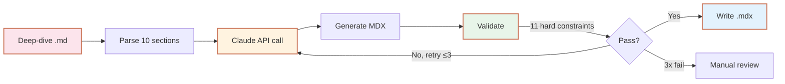

<h1 align="center">
  
  iq-blogger
</h1>

<div align="center">

**딥다이브 문서를 블로그 포스트로 자동 변환하는 에이전트**

<br/>

[](https://iq-agent-lab.github.io)
[](https://iq-proof.github.io)

<br/>

> *"교재 1장(600줄) → 블로그 포스트 1편(300단어). 톤도, 구조도, 깊이도 바꾼다."*

86개 deep-dive 레포의 600여 챕터를 블로그 포스트로 양산한다. 단순 요약이 아닌, **장르 변환** — 교재(teaching material)를 에세이(essay)로.

</div>

---

## 🎯 What This Does

`iq-blogger`는 [iq-agent-lab](https://iq-agent-lab.github.io)의 첫 번째 자동화 도구다. [iq-dev-lab](https://github.com/iq-dev-lab)과 [iq-ai-lab](https://github.com/iq-ai-lab)의 deep-dive 챕터(10섹션 템플릿, ~600줄)를 [iq-proof](https://iq-proof.github.io) 블로그의 MDX 포스트(~300단어, H2 5개)로 변환한다.

### 변환 예시

```
입력:  iq-dev-lab/redis-deep-dive/redis-internals/01-single-thread-event-loop.md
       (10섹션, 607줄, 교재체)

출력:  iq-proof/src/content/posts/redis-single-thread-event-loop.mdx
       (5 H2, 310 단어, 평서체, 트레이드오프 보존)
```

### 변환의 본질 — 단순 요약이 아니다

| 축 | 입력 (교재) | 출력 (에세이) |
|:---|:---|:---|
| **목적** | 가르치기 | 설득·납득 |
| **톤** | "~합니다" (경어체) | "~한다" (평서체) |
| **깊이** | 깊게 + 넓게 | 깊게 + 좁게 |
| **길이** | 500-700줄 | 300±30 단어 |
| **독립성** | 시리즈 내 순차 | 단독 완결 |

---

## 🏗️ How It Works



### 핵심 컴포넌트

| 파일 | 역할 |
|:---|:---|
| `src/agent.ts` | Claude API 호출 + 재시도 루프 |
| `src/validator.ts` | 11개 하드 컨스트레인트 검증 |
| `src/types.ts` | Zod 스키마 + 공유 타입 |
| `src/index.ts` | CLI: `convert` / `validate` |
| `prompts/system.md` | 에이전트 system prompt |
| `prompts/few-shot.md` | 변환 예시 3개 (Spring AOP, Attention, Redis) |
| `docs/conversion-rules.md` | 변환 규칙 SSOT |

---

## ⚙️ The 11 Hard Constraints

품질 보증의 핵심. 모든 출력이 만족해야 함.

| # | 제약 | Severity |
|:--:|:---|:---:|
| 1 | 단어 수 270-330 | error |
| 2 | H2 정확히 5개, 마지막 "정리" | error |
| 3 | 인트로 2-3 문장 (H2 전) | error |
| 4 | tags 3-5개 + kebab-case | error |
| 5 | 경어체 금지 | error |
| 6 | 제목 이모지 금지 | error |
| 7 | "💻 실전 실험", "🤔 생각해볼" 제거 | error |
| 8 | `draft: true`, `featured: false` | error |
| 9 | 미사용 MDX import 금지 | warning |
| 10 | 코드블록 언어 태그 필수 | warning |
| 11 | `$$` 블록 위아래 빈 줄 | warning |

검증 실패 시 자동 재시도 (최대 3회). 각 재시도에서 이전 실패 이유가 프롬프트에 포함.

---

## 🚀 Setup

### Prerequisites
- Node.js 20+
- npm
- Anthropic API key (with credits)

### Install

```bash
git clone https://github.com/iq-agent-lab/iq-blogger.git
cd iq-blogger
npm install
```

### Configure

```bash
cp .env.example .env
# .env 편집해서 ANTHROPIC_API_KEY 설정
```

`.env` 필수 항목:

```bash
ANTHROPIC_API_KEY=sk-ant-api03-...
IQ_BLOGGER_MODEL=claude-sonnet-4-6
IQ_BLOGGER_MAX_RETRIES=3
IQ_BLOGGER_DEBUG=0

# Step 3 (git-ops) 이후 사용
GITHUB_TOKEN=ghp_...
GIT_AUTHOR_NAME=e9ua1
GIT_AUTHOR_EMAIL=e9ua1@users.noreply.github.com
```

### Verify

```bash
npm test       # 13개 테스트 전부 통과
npm run lint   # tsc --noEmit, 타입 에러 없음
```

---

## 💻 Usage

### Single file conversion

```bash
npx tsx src/index.ts convert \
  --source iq-dev-lab/redis-deep-dive \
  --path redis-internals/01-single-thread-event-loop.md \
  --order 1 \
  --title "Redis Internals" \
  --out ./drafts \
  ./test-inputs/01-single-thread-event-loop.md
```

### Validate existing MDX

```bash
npx tsx src/index.ts validate ./drafts/redis-single-thread-event-loop.mdx
```

### 출력 예시

```
[iq-blogger] Converting redis-internals/01-single-thread-event-loop.md (order=1)...
[iq-blogger] Wrote ./drafts/redis-single-thread-event-loop.mdx
[iq-blogger] Attempts: 1 | Tokens: in=12453, out=2104 | Cost: $0.0689
[iq-blogger] Metrics: {"wordCount":310,"h2Count":5,"codeBlockCount":2,...}
```

---

## 📊 Conversion Rules — Section Mapping

10섹션 입력 → 5 H2 출력. 자세한 규칙은 [`docs/conversion-rules.md`](./docs/conversion-rules.md).

| 입력 섹션 | 출력 위치 | 처리 |
|:---|:---|:---|
| 🎯 핵심 질문 | 인트로 마지막 문장 | 가장 날카로운 1개만 |
| 🔍 왜 중요한가 | 인트로 앞 1-2문장 | 축약 |
| 😱 흔한 실수 | H2 #1-#2 도입 | 시나리오 1개만, 또는 생략 |
| ✨ 올바른 접근 | H2 #3-#4 | Before/After 묶음 |
| 🔬 내부 동작 원리 | H2 #2-#3 (메인) | **유지**, H3 ≤3개 |
| 💻 실전 실험 | **생략** | 레포 링크만 |
| 📊 성능 비교 | H2 #4 한 단락 | 대표 수치 1-2개 |
| ⚖️ 트레이드오프 | H2 #4 또는 Callout | **생략 금지** |
| 📌 핵심 정리 | H2 #5 "정리" | bullet 3-4개 |
| 🤔 생각해볼 문제 | **생략** | — |

**철칙**: 트레이드오프는 무조건 살린다. 블로그 DNA의 핵심.

---

## 🛣️ Roadmap

| Step | Status | Description |
|:----:|:------:|:------------|
| 1 | ✅ Done | `agent.ts` — Claude API + 재시도 루프 |
| 2 | ✅ Done | `validator.ts` — 11개 hard constraint |
| 3 | 🚧 Next | `git-ops.ts` — 소스 레포 클론, 블로그 PR 생성 |
| 4 | 📋 Planned | README 브랜드 톤 정리 |
| 5 | 📋 Planned | `config/sources.json` — 변환 대상 선언 |

---

## 💰 Cost

Claude Sonnet 4.5 기준:

| 단위 | 토큰 | 비용 |
|:---|:---|:---|
| 챕터 1개 | ~12K in / ~2K out | ~$0.07 |
| 레포 1개 (~7챕터) | — | ~$0.50 |
| 전체 86 레포 (~600 챕터) | — | ~$66 |

비용은 입력 길이에 비례. AI 레포(수식 많음)는 평균 대비 약간 더 높을 수 있음.

---

## 🧠 Design Decisions

### Why Anthropic SDK (not Claude Agent SDK)?
- 입출력이 순수 텍스트 (MD → MDX). Tool use 불필요
- 재시도 로직을 validator 결과 기반으로 결정적 제어
- 토큰·비용 정확한 예측

### Why 11 hard constraints?
- 자유도가 높은 프롬프트는 평균 품질의 글을 양산
- 명시적 컨스트레인트가 일관성을 보장
- 검증 가능한 자동화 = 큐레이션 가능한 자동화

### Why Zod schemas mirror the blog's `content.config.ts`?
- 블로그가 받아주는 frontmatter ≠ 블로그가 원하는 frontmatter
- 계약(스키마)과 컨벤션(스타일)을 분리해서 강제

자세한 설계 회고: [iq-proof: 이 블로그는 어떻게 만들어졌나](https://iq-proof.github.io/posts/iq-blogger-system).

---

## 🔗 Related

- **[iq-agent-lab](https://iq-agent-lab.github.io)** — 이 도구가 속한 자동화 인프라 연구소
- **[iq-proof](https://iq-proof.github.io)** — 변환 결과가 발행되는 블로그
- **[iq-dev-lab](https://iq-dev-lab.github.io)** — 입력 소스 #1 (백엔드 deep-dive)
- **[iq-ai-lab](https://iq-ai-lab.github.io)** — 입력 소스 #2 (AI deep-dive)

---

<div align="center">

*iq-blogger는 iq-agent-lab의 첫 번째 검증 사례입니다.<br/>
이 도구가 작동한다는 것은, 자동화 인프라 패턴이 텍스트 도메인에서 작동한다는 것을 증명합니다.*

<br/>

Operated by [@e9ua1](https://github.com/e9ua1) (아이큐).

</div>
