<h1 align="center">
  
  iq-blogger
</h1>

<div align="center">

**deep-dive 레포를 블로그 시리즈로 자동 변환하는 에이전트**

<br/>

[](https://iq-agent-lab.github.io)
[](https://iq-proof.github.io)

<br/>

> *"5-7 챕터(~3500줄) → 종합 에세이 1편(~1000단어). 챕터들의 공통 원리를 추출한다."*

86개 deep-dive 레포의 600여 폴더를 블로그 종합 에세이로 양산한다. 단순 요약이 아닌, **합성(synthesis)** — 여러 챕터를 관통하는 하나의 원리를 발견한다.

</div>

---

## 🎯 What This Does

`iq-blogger`는 [iq-agent-lab](https://iq-agent-lab.github.io)의 첫 번째 자동화 도구다. [iq-dev-lab](https://github.com/iq-dev-lab)과 [iq-ai-lab](https://github.com/iq-ai-lab)의 deep-dive 폴더(5-7개 챕터, ~3500줄)를 [iq-proof](https://iq-proof.github.io) 블로그의 종합 에세이(~1000단어, 5-7개 H2)로 변환한다.

### 변환 예시

```
입력:  iq-ai-lab/transformer-deep-dive/ch1-attention-decomposition/
       ├── 01-scaled-dot-product.md
       ├── 02-sqrt-dk-scaling.md
       ├── 03-softmax-saturation.md
       ├── 04-attention-as-kernel.md
       ├── 05-multi-head.md
       └── 06-interpretability-debate.md
       (6개 챕터, 학술 자료체)

출력:  drafts/iq-ai-lab-transformer-deep-dive/ch1-attention-decomposition.mdx
       "Attention은 왜 그렇게 설계됐는가"
       (6 H2, 803 단어, 평서체, Theorem/Proof 컴포넌트, 통합 메시지)
```

### 합성의 본질 — 단순 요약이 아니다

| 축 | 입력 (deep-dive 시리즈) | 출력 (종합 에세이) |
|:---|:---|:---|
| **목적** | 가르치기 | 통합 원리 발견 |
| **단위** | 5-7개 분리된 챕터 | 1개의 통합 글 |
| **톤** | "~합니다" (경어체) | "~한다" (평서체) |
| **구조** | 각 챕터 독립 10섹션 | 하나의 narrative arc |
| **메시지** | 챕터별 "무엇" | 전체를 관통하는 "왜" |
| **길이** | ~3500줄 | ~1000단어 |

핵심: **공통 원리 발견**. 예: Redis의 단일 스레드, 메모리, 만료, Threaded I/O가 별개로 보이지만 사실 모두 *"명령어 실행의 단순성을 유지하면서 나머지 병목만 제거하라"*는 한 원칙에서 나옴.

---

## ✅ Status — Production Validated

본격 양산 결과 (iq-dev-lab 34 + iq-ai-lab 25 = 59 레포):

| 단계 | 레포 | 폴더 | 첫 시도 통과 | 비용 | 비고 |
|:---|:---:|:---:|:---:|:---:|:---|
| Smoke (sync) | 1 | 1 | 100% | $0.21 | redis (이전 검증) |
| Batch #1 | 3 | 21 | 100% | $1.81 | kafka, rabbitmq, grpc |
| Batch #2 | 31 | 218 | 99.5% | $24.87 | spring/infra/db/security 등, fallback 12회 |
| Batch #3 | 1 | 14 | 36% | $5.56 | java-api-reference (API 스타일, fallback 9회) |
| Batch #4 (ai-lab) | 21 | 147 | 99% | $16.54 | RL/LLM/CV/NLP/Audio/Systems, fallback 3회 |
| **누적** | **59** | **401** | **~95%** | **~$50** | Layer 6 양산만 잔여 |

**평균 $0.124/폴더 (sync + caching + batch). 8/8 검증 시점 $0.215/폴더 대비 ~60% 절감 일관 유지.**

---

## 🏗️ How It Works

```mermaid
graph LR
    A[GitHub source repos] --> B[git-ops: clone or pull]
    B --> C{Mode?}
    C -->|repo-converter| D[Sync API call]
    C -->|batch-converter| BATCH[Batch API: N reqs]
    BATCH --> POLL[Poll until ended]
    POLL --> D
    D --> E[agent + cache_control]
    E --> F[validator: 12 constraints]
    F -->|Pass| G[Write .mdx to drafts/]
    F -->|Fail, retry up to 3| E
    G --> H[publisher: deploy]
    H --> I[Live on iq-proof.github.io]

    style A fill:#fce4ec,stroke:#cc785c,stroke-width:2px
    style BATCH fill:#fff8e1,stroke:#f9a825,stroke-width:2px
    style E fill:#fff3e0,stroke:#cc785c,stroke-width:2px
    style F fill:#e8f5e9,stroke:#cc785c,stroke-width:2px
    style G fill:#e3f2fd,stroke:#cc785c,stroke-width:2px
    style I fill:#f3e5f5,stroke:#cc785c,stroke-width:2px
```



### 핵심 컴포넌트

| 파일 | 역할 |
|:---|:---|
| `src/agent.ts` | Claude API 호출 + 재시도 루프 + prompt caching (1h TTL) |
| `src/validator.ts` | 12개 검증 규칙 (error + warning 2-tier) |
| `src/folder-converter.ts` | 폴더 5-7 챕터를 1개 종합 글로 (sync) |
| `src/repo-converter.ts` | 레포 단위 — 모든 폴더 자동 발견 + 처리 (sync) |
| `src/batch-converter.ts` | **N 레포를 단일 Batch API 요청으로 일괄 처리** (50% 할인) |
| `src/git-ops.ts` | GitHub 자동 클론 + 캐싱 (`.cache/sources/`) |
| `src/progress.ts` | 진행 상태 추적 (`drafts/progress.json`) |
| `src/publisher.ts` | 배포 — drafts → blog → commit → push |
| `src/types.ts` | Zod 스키마 + 공유 타입 |
| `src/index.ts` | CLI: 9개 명령어 |
| `prompts/system.md` | 합성 system prompt |
| `prompts/few-shot.md` | 변환 예시 (Spring AOP, Attention, Redis) |

---

## ⚙️ The 12 Constraints

### Hard errors (재시도 트리거)

| # | 제약 |
|:--:|:---|
| 1 | 단어 수 500-2000 (권장 700-1500, 1000 목표) |
| 2 | H2 5-7개, 마지막 "정리" |
| 3 | 인트로 H2 없이 시작, 5문장 이내 |
| 4 | tags 3-5개 + kebab-case |
| 5 | 경어체 금지 (`~합니다` → `~한다`) |
| 6 | 제목 이모지 금지 |
| 7 | "💻 실전 실험", "🤔 생각해볼" 섹션 제거 |
| 8 | `draft: true`, `featured: false` |
| 12 | Reference 환각 방지 — 본문 인용된 논문만 사용 |

### Warnings (통과는 가능, 정보용)

| # | 제약 |
|:--:|:---|
| 9 | 미사용 MDX import |
| 10 | 코드블록 언어 태그 누락 |
| 11 | `$$` 블록 위아래 빈 줄 |

검증 실패 시 자동 재시도 (최대 3회). 실제 양산에서는 100% 첫 시도 통과.

---

## 🚀 Setup

### Prerequisites
- Node.js 20+
- npm
- Anthropic API key (with credits)
- iq-proof 블로그 레포 (로컬에 클론됨)

### Install

```bash
git clone https://github.com/iq-agent-lab/iq-blogger.git
cd iq-blogger
npm install
```

### Configure

```bash
cp .env.example .env
# .env 편집
```

`.env` 필수 항목:

```bash
ANTHROPIC_API_KEY=sk-ant-api03-...
IQ_BLOGGER_MODEL=claude-sonnet-4-6
IQ_BLOGGER_MAX_RETRIES=3
IQ_BLOGGER_DEBUG=0
IQ_PROOF_PATH=/Users/<you>/iq-lab/iq-proof.github.io

# Public 레포는 토큰 불필요. private 레포 시 사용.
GITHUB_TOKEN=ghp_...
```

### Verify

```bash
npm test       # 14개 테스트 통과
npm run lint   # tsc --noEmit, 타입 에러 없음
```

---

## 💻 Usage

### 양산 워크플로우

#### A. 단일 레포 양산 (실시간 피드백, 즉시 deploy)

```bash
# 1. 양산 — 레포 자동 클론 + 모든 폴더 sync 변환
npx tsx src/index.ts convert-repo iq-ai-lab/<레포명>

# 2. 진행 확인
npx tsx src/index.ts status

# 3. 배포 — drafts → blog → commit → push (자동)
npx tsx src/index.ts deploy --repo iq-ai-lab/<레포명>
```

#### B. 대량 양산 (Batch — 50% 할인, async)

```bash
# 1. N 레포를 단일 Anthropic Batch로 제출 (보통 1시간 내, 최대 24h)
npx tsx src/index.ts convert-batch \
  iq-dev-lab/spring-core-deep-dive \
  iq-dev-lab/redis-deep-dive \
  iq-dev-lab/kafka-deep-dive \
  ...

# 2. 완료되면 레포별로 검토 + 배포 (deploy는 그대로 레포 단위)
npx tsx src/index.ts deploy --repo iq-dev-lab/<레포명>
```

> 💡 **언제 어떤 걸?**
> - **convert-repo**: 1~2 레포, 즉시 결과/검토 필요할 때
> - **convert-batch**: 5+ 레포 일괄, 비용 절감 우선, 완료까지 기다릴 수 있을 때

### 모든 명령어

| 명령어 | 용도 |
|:---|:---|
| `convert-batch <repo1> [repo2 ...]` | **N 레포를 단일 batch로 (50% 할인, async ≤24h)** |
| `convert-repo <org/repo>` | 레포 자동 클론 + 모든 폴더 종합 (sync, 실시간) |
| `convert-folder <path>` | 단일 폴더 종합 (수동) |
| `convert <file>` | 단일 챕터 변환 (1챕터 → 1글, 레거시) |
| `status` | 진행 상태 확인 |
| `clone <org/repo>` | 소스 레포만 클론 (디버깅) |
| `validate <file>` | 기존 .mdx 검증 |
| `deploy [--repo X]` | 블로그로 배포 (자동 commit + push) |
| `revert [--repo X \| --slug Y]` | 배포 후 retract |

### 출력 예시 — `convert-repo`

```
[git-ops] Updating iq-ai-lab/transformer-deep-dive (cache hit)...
[repo-converter] Found 7 folder(s) to process

[1/7] ch1-attention-decomposition ... ⏭️  skipped (already done)
[2/7] ch2-transformer-architecture ... ⏭️  skipped (already done)
[3/7] ch3-positional-encoding ... ✅ done (732w, 1 attempt, $0.21)
[4/7] ch4-training-math ... ✅ done (830w, 1 attempt, $0.20)
[5/7] ch5-attention-efficiency ... ✅ done (883w, 1 attempt, $0.25)
[6/7] ch6-modern-architectures ... ✅ done (796w, 1 attempt, $0.21)
[7/7] ch7-llm-icl ... ✅ done (959w, 1 attempt, $0.19)

━━━━━━━━━━━━━━━━━━━━━━━━━━━━━━━━━━━━━━━━━━━━━━━━━━
Summary for iq-ai-lab/transformer-deep-dive:
  ✅ Done:     5
  ⏭️  Skipped:  2
  ❌ Failed:   0
  Total cost: $1.06
  Duration:   344.6s
```

### Recovery

문제 발견 시:
```bash
# 단일 글 retract
npx tsx src/index.ts revert --slug ch7-llm-icl

# 전체 레포 retract
npx tsx src/index.ts revert --repo iq-ai-lab/transformer-deep-dive
```

---

## 💰 Cost

Claude Sonnet 4.6 기준 (실측, 2026-05).

### 폴더당 비용 (3가지 모드 비교)

| 모드 | 폴더당 | vs base | 메모 |
|:---|:---:|:---:|:---|
| sync (base) | ~$0.21 | — | 캐싱 없음 |
| sync + caching | ~$0.18 | -14% | few-shot block (~12K) cache hit |
| **batch + caching** | **~$0.086** | **-60%** | 50% batch discount × 캐싱 효과 |

### 양산 단위 비용 추정

| 단위 | sync | batch+caching |
|:---|:---:|:---:|
| 레포 1개 (~7 폴더) | ~$1.50 | ~$0.60 |
| 86 레포 (~600 폴더) | ~$130 | ~**$52** |

### Caching 작동 방식

- `system.md` (~5.5K) + `few-shot.md` (~6.5K) = ~12K 토큰을 1h TTL로 캐싱
- 첫 호출은 cache write (2x), 이후 호출은 cache read (0.1x)
- task + chapters는 폴더마다 다르므로 캐싱 안 함 (write 비용 손해 회피)
- 검증: `cache_read_input_tokens` 가 두 번째 호출부터 ~12K로 표시되면 hit

### Batch API 작동 방식

- N 폴더 요청을 단일 `messages.batches.create()` 로 제출 → 50% 할인
- typically <1h, 최대 24h (Anthropic SLA)
- 검증 실패 시 자동으로 sync `convertFolder()` fallback (재시도 인라인)
- `custom_id = "{org}--{repo}__{folder}"` 로 결과 매핑
- 누적 양산 결과: 254 폴더 / **$33.20** (다른 비용 fix 포함)

---

## 🛣️ Roadmap

| Phase | Status | Description |
|:----:|:------:|:------------|
| 1 | ✅ | `agent.ts` — Claude API + 재시도 루프 |
| 2 | ✅ | `validator.ts` — 12개 검증 규칙 (2-tier) |
| 3 | ✅ | `folder-converter.ts` — 종합 변환 |
| 4 | ✅ | `git-ops.ts` — GitHub 자동 클론 |
| 5 | ✅ | `repo-converter.ts` — 레포 단위 자동화 |
| 6 | ✅ | `progress.ts` — 진행 추적 |
| 7 | ✅ | `publisher.ts` — 배포 자동화 (deploy/revert) |
| 8 | ✅ | iq-dev-lab 34 레포 / 254 폴더 1차 양산 완료 |
| 9 | ✅ | **Prompt caching** — few-shot block에 1h TTL 캐싱 (~14% 절감) |
| 10 | ✅ | **Batch API** — `convert-batch` 명령으로 50% 할인 (캐싱과 합쳐 ~60%) |
| 11 | ✅ | iq-ai-lab Layer 0–5 양산 (25 레포 / 175 폴더) |
| 12 | 🚧 | iq-ai-lab Layer 6 (Frontier LLM) — Mech Interp · Reasoning · RAG |

---

## 🧠 Design Decisions

### Why folder = 1 post (not chapter = 1 post)?
- 1 챕터 = 1 글이면 3000+ 글이 양산됨 — GitHub Pages 한계 + "그냥 옮긴 느낌"
- 5-7 챕터 종합 = 600 글 — 적정 양 + **큐레이션의 의미**
- 합성은 챕터들의 공통 원리를 발견하는 작업, 가치 있음

### Why Anthropic SDK (not Claude Agent SDK)?
- 입출력이 순수 텍스트 (.md → .mdx). Tool use 불필요
- 재시도를 validator 결과 기반으로 결정적 제어
- 토큰·비용 정확한 예측

### Why 2-tier validation (error + warning)?
- 빡빡한 검증은 재시도 진동(oscillation) 유발
- Hard error (재시도) vs Warning (정보용 통과) 분리
- 첫 시도 통과율 100% 달성

### Why no auto-publish to blog without review?
- "Curation is non-negotiable" — 메타 글의 핵심 원칙
- 자동: 양산, 검증, 배포 명령
- 수동: 검수 + 발행 결정 (`deploy` 실행 시점)
- `revert` 명령으로 사후 수정 가능

### Why cache only the few-shot block (not task+chapters)?
- few-shot block (~12K)은 모든 폴더에서 byte-identical → cross-folder cache hit ✅
- task+chapters는 폴더마다 다름 → cache write 비용(2x)이 매번 부과되어 net loss
- 마커 1개로 cross-call 캐싱만 활성화. retry는 ~12% 빈도라 별도 마커 비효율

### Why batch API + sync fallback (not pure batch)?
- 단일 batch 요청 = 50% 할인. 250+ 폴더 양산에서 명확한 비용 우위
- 검증 실패한 폴더는 batch 결과 받아본 뒤 sync로 재시도 (validator 피드백 루프 보존)
- 결과: 254 폴더 중 22건 fallback, 모두 1~3 attempt 안에 통과

설계 회고: [iq-proof: 이 블로그는 어떻게 만들어졌나](https://iq-proof.github.io/posts/iq-blogger-system).

---

## 🔗 Related

- **[iq-agent-lab](https://iq-agent-lab.github.io)** — 이 도구가 속한 자동화 인프라 연구소
- **[iq-proof](https://iq-proof.github.io)** — 변환 결과가 발행되는 블로그
- **[iq-dev-lab](https://github.com/iq-dev-lab)** — 입력 소스 #1 (백엔드 deep-dive)
- **[iq-ai-lab](https://github.com/iq-ai-lab)** — 입력 소스 #2 (AI deep-dive)

---

<div align="center">

*iq-blogger는 iq-agent-lab의 첫 번째 검증 사례입니다.<br/>
"검증 가능한 자동화"가 텍스트 생성 도메인에서 작동함을 증명합니다.*

<br/>

Operated by [@e9ua1](https://github.com/e9ua1) (아이큐).

</div>
